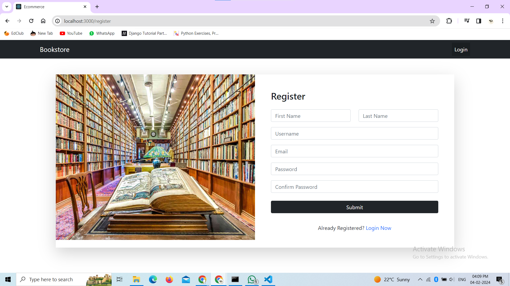
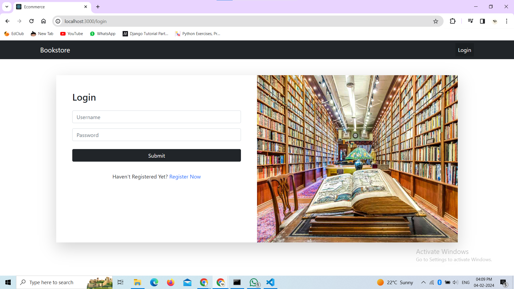
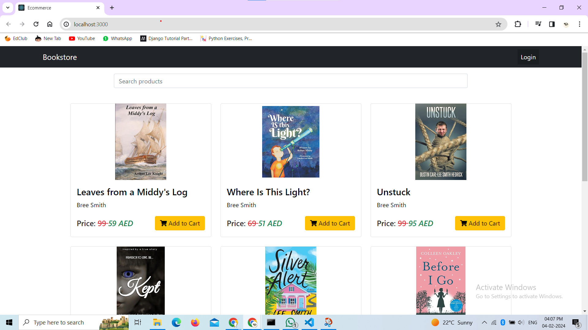
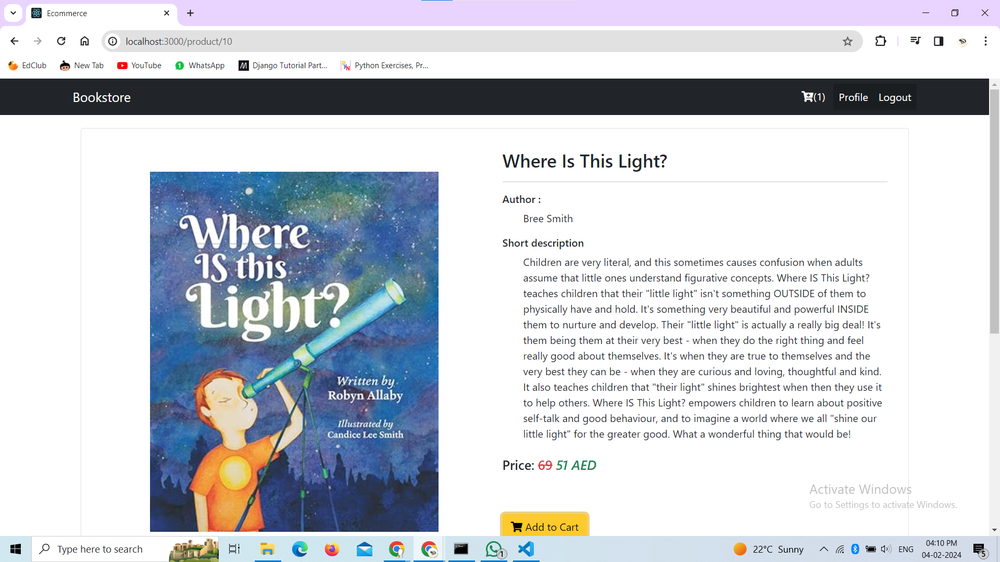
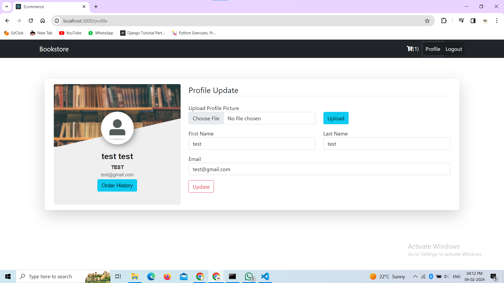
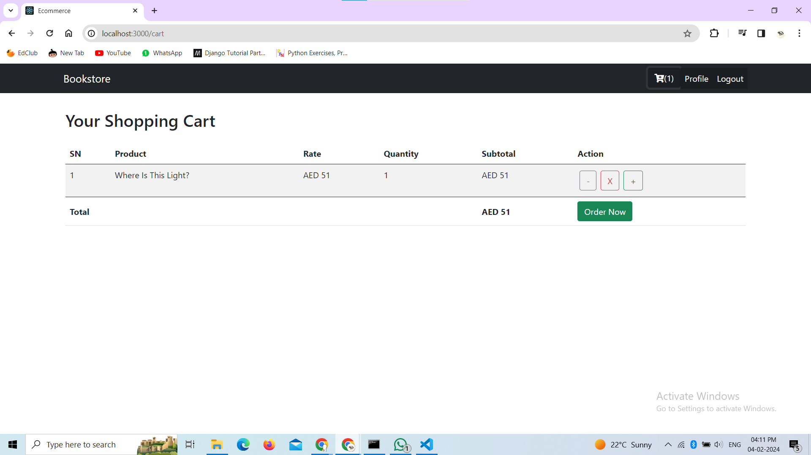
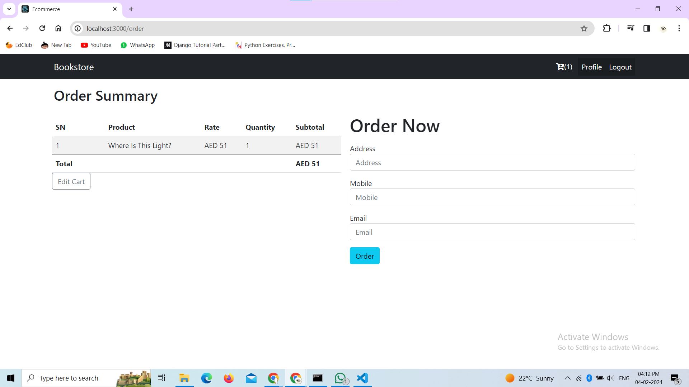
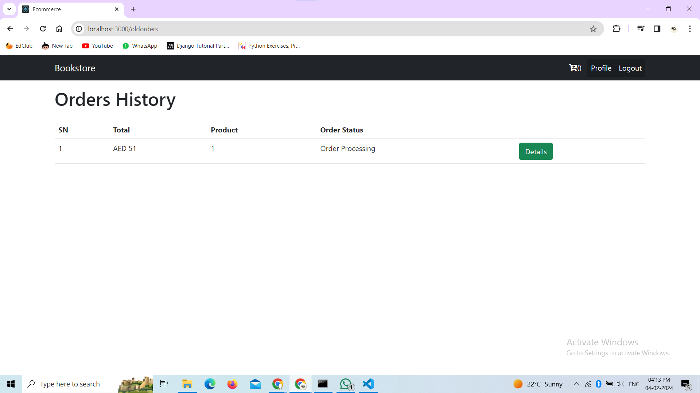
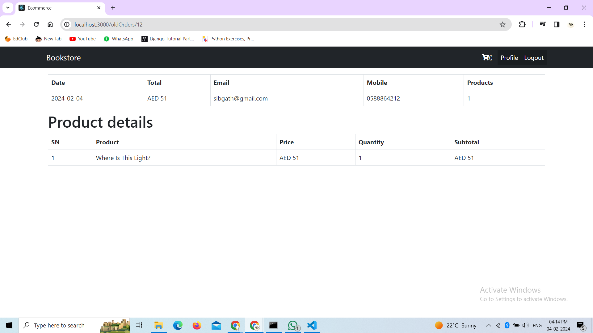

# bookstore

This is an e-commerce web application developed using React.js for the front end, Python for the backend and sqllite3 for the database. The project includes features such as product listing, cart management, user profiles, order history, and more.

## Technologies Used

- **Frontend:**
  - React.js  
  - React Router (for navigation)

- **Backend:**
  - Python
  - Django
  - Django REST Framework

## Frontend

1. **Home:**
   - Overview of featured products.

2. **Product Details:**
   - Detailed information about a specific product.

3. **Cart:**
   - View and manage items in the shopping cart.

4. **Checkout:**
   - Complete the purchase by providing shipping details.

5. **Profile:**
   - View and update user profile information.

6. **Order History:**
   - View a history of past orders.

7. **Login and Signup:**
   - Authentication pages for user login and registration.


## Backend

- The backend is developed in Python using the Django framework.
- API calls are made to the backend to store and retrieve data.
  

1. **User Authentication:**
   - authentication management.

2. **Product Management:**
   - product details management.

3. **Cart Management:**
   - cart details management.

4. **Order Management:**
   - order details management.

## Setup Instructions

1. Clone the repository:

   ```bash
   git clone https://github.com/Sibgathrahman/bookstore.git

2. frontend
  - cd frontend
  - npm install
  - npm start

3. Backend
  - cd backend
  - pip install -r requirements.txt
  - python manage.py makemigrations
  - python manage.py migrate
  - python manage.py runserver


## UI Designs

**Registration Page**



**Login Page**



**Home page**



**Product Details Page**



**Profile Page**



**Cart Page**



**Checkout Page**



**Order History Page**



**Order Details Page**

